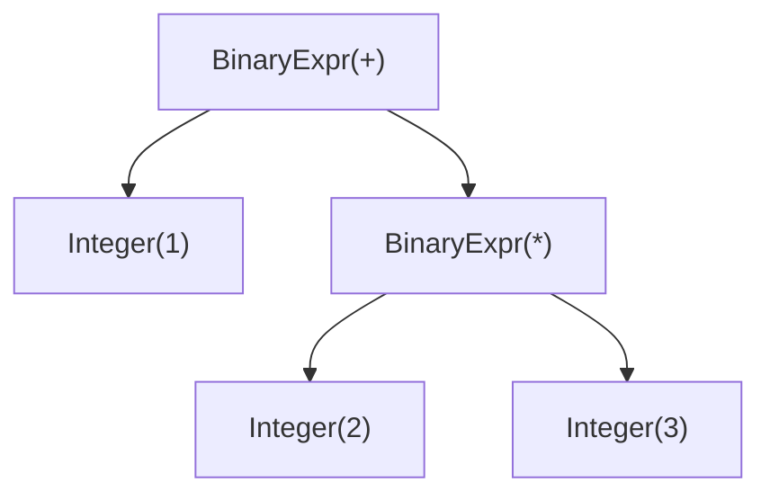

<h1 align="center">Teeny - CS Capstone Project</h1>

## Compiler Architecture

### Parser
The parser uses both recursive descent and Pratt. Recursive descent is used to parse statements, and Pratt is used to parse expressions. The reason for the split is because it's simple to implement a recursive descent for everything but operator precedence. If the language has a dozen different levels of operator precedence, each level would require its own recursive functions in a recursive descent parser. With a Pratt parser, however, operators are assigned numerical precedence values and parsed in order of least to greatest, and the same code is used to parse everything.

The expression `1 + 2 * 3` is turned into the following AST:

## Resources Used
[Simple but Powerful Pratt Parsing](https://matklad.github.io/2020/04/13/simple-but-powerful-pratt-parsing.html)
[Crafting Interpreters](https://craftinginterpreters.com/)
