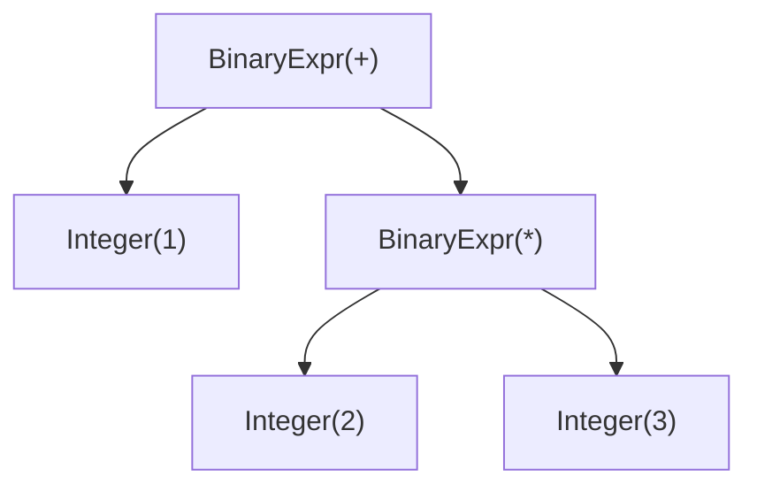

[](https://github.com/Benricheson101/teeny/actions/workflows/ci.yml)
[](https://codecov.io/gh/Benricheson101/teeny)

<h1 align="center">Teeny - CS Capstone Project</h1>

# Usage
```
Usage: teenyc [OPTIONS] <IN_FILE>

Arguments:
  <IN_FILE>  the teeny script to compile

Options:
  -o, --out-file <OUT_FILE>  where to output (default: out.bin)
  -h, --help                 Print help
```

```sh
$ cargo build --release
$ ./target/release/teenyc ./program.tny -o ./program.asm
```

# Compiler Architecture

## Parser
The parser uses both recursive descent and Pratt. Recursive descent is used to parse statements, and Pratt is used to parse expressions. The reason for the split is because it's simple to implement a recursive descent for everything but operator precedence. If the language has a dozen different levels of operator precedence, each level would require its own recursive functions in a recursive descent parser. With a Pratt parser, however, operators are assigned numerical precedence values and parsed in order of least to greatest, and the same code is used to parse everything.

The expression `1 + 2 * 3` is turned into the following AST:


## Code Generation
Teenyc is a stack machine-based compiler. All values are pushed to the stack and only popped immediately before they are used.

### Calling Convention
Teeny uses a callee-saved calling convention, meaning called functions are responsible for backing up and restoring any registers used. In a stack machine, this only applies to the frame pointer `rE`. Registers `rA` and `rB` are used as the working registers for all operations. Function arguments are passed in as `rA`-`rC`, then spilled onto the stack. `rA` is used to return a value from a function.

```rs
fn math(a: int, b: int, c: int) -> int {
    return a * c - b; // parsed as (a * c) - b
}
```

```asm
; back up parent frame pointer
psh rE
; stack frame pointer
set rE, SP

; push parameters to the stack
psh rA ; address of `a`: [rE - 0]
psh rB ; address of `b`: [rE - 1]
psh rC ; address of `c`: [rE - 2]

;                           + rE -
;     (bottom)                vvv           (top)
; stack: [ret_addr, rE_saved, `a`, `b`, `c`]

; push `a` to the top of the stack
lod rA, [rE - 0]
psh rA

; push `c` to the top of the stack
lod rA, [rE - 2]
psh rA

; stack: [ret_addr, rE_saved, `a`, `b`, `c`, `a`, `c`]

; perform `mpy` with top two stack values
pop rB     ; `c`
pop rA     ; `a`
mpy rA, rB ; rA = a * c

; push result to stack
psh rA

; stack: [ret_addr, rE_saved, `a`, `b`, `c`, `a * c`]

; push `b` to the top of the stack
lod rA, [rE - 1]
psh rA

; stack: [ret_addr, rE_saved, `a`, `b`, `c`, `a * c`, `b`]

; perform `sub` with top two stack values
pop rB     ; `b`
pop rA     ; `a * c`
sub rA, rB ; rA = (a * c) - b

; push result to stack
psh rA

; stack: [ret_addr, rE_saved, `a`, `b`, `c`, `a * c - b`]

; pop return value into rA (return register)
pop rA

; stack: [ret_addr, rE_saved, `a`, `b`, `c`]

; restore stack pointer (clear memory used by function)
set SP, rE

; stack: [ret_addr, rE_saved]

; restore parent frame pointer
pop rE

; stack: [ret_addr]
ret
```

# Resources Used
[Simple but Powerful Pratt Parsing](https://matklad.github.io/2020/04/13/simple-but-powerful-pratt-parsing.html) \
[Crafting Interpreters](https://craftinginterpreters.com/)
